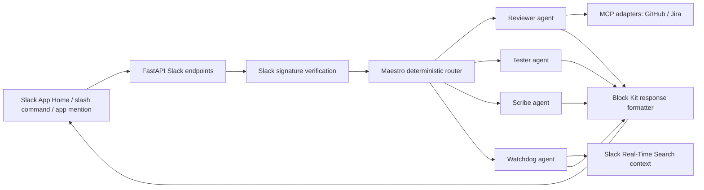

# Architecture Proof

## Evidence In Repo

- Slack manifest: `ops/slack-app-manifest.json`
- Slack signature verification: `services/api/app/slack/signature.py`
- Slash command parser: `services/api/app/slack/command_parser.py`
- Maestro router: `services/api/app/maestro/router.py`
- Demo agents: `services/api/app/agents/`
- MCP evidence adapter: `services/api/app/integrations/mcp_context.py`
- RTS evidence adapter: `services/api/app/integrations/rts_search.py`
- Judge console: `apps/web/`
- Diagram assets: `assets/diagrams/architecture.svg` and `assets/diagrams/architecture.png`
- Tests: `tests/unit/`
